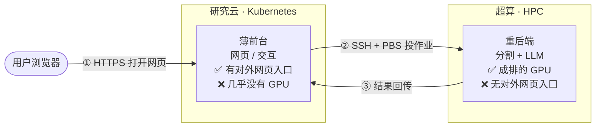

# 4.5 From Zero to End App ― 从一个想法,到 dashboard 一步步长成

> **本章目的**:带你走一遍 **JPeaks-Forest 仪表盘**的"孕育过程"——它不是一次设计好的,而是从一个很朴素的想法出发,撞上一个个真实问题,和 Claude Code 一轮轮把它一步步养大的。读完你会明白:每一块功能**为什么**存在。
>
> 打包上云(容器化 → 部署 → 更新)的操作细节不在这里,交给 [05](05-コンテナ化.md)–[10](10-更新とトラブル対処.md);本章讲"这个 app 是怎么长出来的"。
>
> `<...>` 占位符含义见 [00 全体像](00-はじめに-全体像.md)。

---

## 0. 起点:一个很朴素的想法

我们手里有两样东西:一堆森林的无人机/LiDAR 点云,和一个能把点云里**每棵树分割出来**的模型(ForestFormer3D)。问题是——这个模型跑在**超算**上,要 SSH 登录、写 PBS 作业脚本、命令行操作。对做森林的研究者来说,这门槛太高了。

于是有了最初的一句话愿望:

> **"能不能给它做个网页?研究者把点云拖进去,就能看到每棵树的分割结果和分析,完全不用碰超算。"**

整个项目就是从这句话长出来的。

---

## 1. 第一个岔路口:前台和后端必须分家

刚要动手就撞到一个现实约束:

- **研究云**(Kubernetes,能开网页给人访问)——但**几乎没有 GPU**。
- **超算**(有成排的 GPU)——但**没有对外的网页入口**,只能内部 SSH。

两边各有一半,谁都不能单独把事办了。所以第一个、也是最重要的设计决定诞生了:

> **薄前台 + 重后端**:网页(前台)放在研究云,只管交互;真正吃 GPU 的分割和 LLM 放在超算(后端);中间用 **SSH + PBS 投作业**把两边接起来。



> 看图就懂"各有一半":研究云有**入口**没 **GPU**,超算有 **GPU** 没**入口**;`SSH + PBS` 这座桥把两半接成一个能用的整体。

这条"两层架构"定了调,后面所有东西都长在它上面。第一次跟 Claude Code 说的,其实就是这个骨架:

```
做一个网页服务(FastAPI):用户上传点云后,
通过 SSH 把一个分割任务投到超算(PBS 队列),
等它跑完,把结果下载回来展示。前端先来个单页 dashboard.html。
```

> **为什么前端选"单页 + 内联"**:研究云上部署越简单越好,不想再养一套前端构建。所以整个前端就一个 `dashboard.html`,CSS/JS 全内联,烤进镜像即走。这个选择很省事,但也埋了个雷(见第 5 节)。

---

## 2. 验证整条计算链路

这一步暂时不开发正式功能,而是先验证上一节设计的计算链路能否真正跑通:

> 将点云从研究云传到超算,在超算上提交 GPU 分割任务,等待任务完成,再把结果文件取回。

验证时,我们不通过网页逐项手动操作,而是让 Claude Code 编写一组小型测试脚本,并使用一份真实但规模较小的点云数据,自动走完整条链路。

这样做的目的,是把原本依赖人工操作的验证过程,变成一套**可以重复执行、能够明确判断成功或失败的测试**。

### 按链路逐步生成测试

我们按照数据流转顺序,把任务逐步描述给 Claude Code:

> **① 上传测试数据**
> 将一小份测试点云上传到超算指定目录,并检查文件是否存在、大小是否正确。
>
> **② 提交计算任务**
> 通过 SSH 登录超算的登录节点,调用 `qsub` 提交点云分割任务,并打印返回的作业号。
>
> **③ 等待任务完成**
> 根据作业号轮询队列状态,每隔几秒输出一次进度;任务结束后,检查超算侧是否生成了 `result.ply`。
>
> **④ 取回并验证结果**
> 将 `result.ply` 下载到研究云或本地验证环境,检查文件是否存在,并核对点数、文件大小等基本信息。
>
> **⑤ 串联端到端流程**
> 将上传、提交、等待和下载四个步骤组合成一个完整测试。任何一步失败,都必须指出失败阶段并输出原始错误信息。
>
> **⑥ 根据报错迭代修复**
> 当测试失败时,直接把完整报错交给 Claude Code,例如:
> "运行时出现以下错误:`<粘贴原始报错>`。请解释原因,修改对应测试,并重新运行。"

Claude Code 会把这些要求分别落实为测试文件,执行测试,并根据输出继续修改。经过几轮迭代后,整条计算链路就不再只是架构图上的连线,而是变成了一组实际运行过的自动化测试。

### 为什么每一步都要写成独立测试

这里有一个重要原则:**每个环节都应保存为独立的测试文件,而不是只执行一次临时命令。**

独立测试具有明确的输入、输出和通过条件,因此 Claude Code 可以自行运行测试、查看结果并判断是否成功,不需要人工持续观察和解释。

与此同时,这些文件还会沉淀为后续可复用的诊断工具。例如:

* SSH 是否可用;
* 输入文件能否上传;
* PBS 作业能否提交;
* 队列状态能否查询;
* 推理结果是否生成;
* 结果文件能否下载。

以后无论是修改环境、迁移集群,还是排查线上问题,都可以直接重新运行相应测试,而不必从头手动检查。

### 最终得到的测试集

| 测试文件 | 验证动作 | 通过标准 |
| --- | --- | --- |
| `test_upload.py` | 将测试点云上传到超算 | 文件存在,路径和大小正确 |
| `test_ssh.py` | SSH 登录超算并执行 `qstat` | 能正常连接,并读取队列信息 |
| `test_submit.py` | 使用 `qsub` 提交分割任务 | 返回有效作业号,任务进入排队或运行状态 |
| `test_infer.py` | 等待作业结束并检查输出 | 任务正常完成,生成 `result.ply` |
| `test_fetch.py` | 将 `result.ply` 下载回来 | 文件成功到达,点数或文件大小符合预期 |
| `test_pipeline.py` | 串联完整端到端流程 | 上传、提交、GPU 分割、下载和结果校验全部通过 |

> 表中的文件名只是示例,应替换为项目中实际保留下来的测试文件名。

### 用测试结果完成排障闭环

排障时,不需要重新检查整条链路。先运行各环节的独立测试,定位具体失败位置,再把该测试的原始报错交给 Claude Code。

例如:

* `test_ssh.py` 失败,通常应检查 SSH 密钥、主机地址或来源网段;
* `test_submit.py` 失败,可能与 PBS 队列、用户组或资源参数有关;
* `test_infer.py` 失败,应检查运行环境、模型路径和 GPU 日志;
* `test_fetch.py` 失败,则重点检查输出路径、文件权限和传输命令。

Claude Code 根据报错修改对应测试,再重新执行。最终,当 `test_pipeline.py` 能够从上传输入数据开始,一直运行到结果下载和校验全部通过时,就可以确认:

> **研究云与超算之间的端到端计算链路已经实际验通。**

---

## 3. 撞墙 ①:结果太大,浏览器直接卡死

一跑真实数据就傻眼了:一片林子的分割结果 PLY 动辄**好几 GB、上亿个点**。想在网页里画出来?浏览器当场卡死。

这逼出了整个项目里最硬核的一块——**八叉树(octree)流式查看器**:

> 不把几 GB 的点云整包塞给浏览器,而是后端先把它组织成**多层八叉树**,前端**按视野和距离,只拉需要的、子采样过的瓦片**(`/viewer/{task}/tiles/*.bin`),几秒就能出画面,拖动时再逐步加载细节。

跟 Claude Code 是这么一块块磨出来的:

```
在结果页加一个 Three.js 点云查看器:
从 /viewer/{task}/metadata.json 读八叉树元数据,
按需拉 /viewer/{task}/tiles/*.bin 流式加载,只显示子采样,
别一次性拉整个 PLY。支持按语义/实例上色、调点大小。
```

> **设计哲学诞生**:*Stream, don't dump.*(流式,别整包甩)。这条后来反复救命——比如重启后打开旧结果,也只拉 ~150MB 的八叉树,而不是几 GB 的原图。

---

## 4. 撞墙 ②:跑一次好几分钟,用户对着空白页干等

分割一片大林子要好几分钟。第一版是"点了按钮,然后……啥也没有,等着"。没人受得了。

于是长出了**实时反馈**这一层:

- 前端**轮询** `/task/{id}/status`,画**进度条**;
- 更进一步:分割是**分块(tiled)**跑的,所以**每完成一个瓦片就先渲染出来**——用户能眼看着林子一块块"长"出来,而不是盯着空白。

> **经验**:凡是"要等"的地方,都得让用户**看见它在动**。后来这条又催生了"查看器拉取时的加载指示"这类打磨(第 8 节)。

---

## 5. 撞墙 ③:一个撇号,整页 JS 全废

随着功能变多,"单页 + 内联 JS"的雷踩响了:有一次改 `dashboard.html` 里的内联脚本,不小心在字符串里多了个撇号,**整段 JS 直接挂掉,整个页面白屏**。

教训变成了一条铁律:

> **改完内联 JS,必须 `node --check`**(把内联脚本抽出来做语法检查)再提交。

这不是"单页内联"这个选择错了——它依旧让部署极简;只是它有代价,而代价要用纪律来管。

---

## 6. 长出血肉:登录、媒体库、分析报告

主干稳了,开始往丰满走。每一块还是同样的节奏——**描述需求 → Claude 改 → 本机看 → 不对再说**:

- **登录 / 多用户**:不能谁都能进,于是加了账号系统,未登录只显示登录卡。
- **媒体库(结果持久化)**:这里又撞了一次墙——前台 pod 的 `/tmp` **一重启就清空**,历史结果全没了。但结果其实**一直在超算上**。于是做了"媒体库":列表从超算**重建**,点开时才按需把该结果的八叉树拉回来(又是 *stream, don't dump*)。
- **LLM / VLM 分析**:光有分割不够,研究者还想要**物种、健康、碳**。于是加了 Analyze 页:整片林子的**场景分析**(stand-level)、点单棵树的**健康分析**(per-tree),这些同样投到超算的 GPU 上跑大模型。

---

## 7. 还有一条暗线:大文件传得慢

前台后端分处两地,大点云要在它们之间来回传。可这条链路一度只有 **~1 Gbps**(走的是超算的管理网口),传个几 GB 就得等半天。这背后是一整条网络排查(公网 IP、rclone、方向选择),目前仍在优化——它不改变 app 的样子,但决定了它**用起来爽不爽**。

> 这条线告诉你:一个真实系统的瓶颈,常常不在你最初盯着的地方(模型),而在**周边**(网络、存储、重启)。

---

## 8. 怎么让它"每天都能改":快速迭代循环

功能越加越多,就越需要**改起来快**。这里有个关键机制:镜像里的 `/app` 是个 git 仓库、**启动时会 `git pull`**。于是改前端**根本不用重打那个巨大的镜像**:

```
改 dashboard.html / server.py  →  node --check(内联 JS 改过就查)
   →  git push origin main  →  kubectl rollout restart(新 pod 自动拉最新代码)
```

几十秒,新版就上线了。正是这个循环,让 dashboard 能像本章描述的这样"一轮一轮"快速长大。细节和回滚见 [10](10-更新とトラブル対処.md)。

本手册写作期间,它还在继续长——比如:任务不再硬超时、加了手动取消;查看器拉取时加了转圈+计时;把品牌统一成 **JPeaks-Forest**……每一条都是"发现一个不爽 → 一轮改掉"。

---

## 9. 回头看:它是怎么长成现在这样的

把成长线连起来,其实就几条一以贯之的原则在起作用:

| 撞到的问题 | 长出的东西 | 沉淀的原则 |
|---|---|---|
| 模型只能在超算命令行跑 | 两层架构(薄前台+重后端) | 各用所长,SSH/PBS 搭桥 |
| 结果几 GB,浏览器卡死 | 八叉树流式查看器 | **Stream, don't dump** |
| 跑一次好几分钟 | 进度条 + 增量瓦片预览 | 要等就让人看见在动 |
| 内联 JS 一个撇号全废 | `node --check` 纪律 | 简单的选择,用纪律兜底 |
| pod 重启结果就没 | 媒体库从超算重建 | 状态放在可靠的一侧(超算) |
| 大文件传得慢 | 网络链路优化(进行中) | 瓶颈常在周边,不在核心 |
| 功能越加越多要常改 | git-pull + rollout restart | 让迭代循环短到几十秒 |

> 这就是它从**一句"能不能做个网页"**,一步步长成今天这个 dashboard 的过程。
>
> 想把它**送上线**(容器化 → 推仓库 → 部署 → 访问 → 更新),接着看:[05](05-コンテナ化.md) → [06](06-レジストリに預ける.md) → [07](07-K8sマニフェスト.md) → [08](08-Rancherで公開.md) → [09](09-アクセスする.md) → [10](10-更新とトラブル対処.md)。
